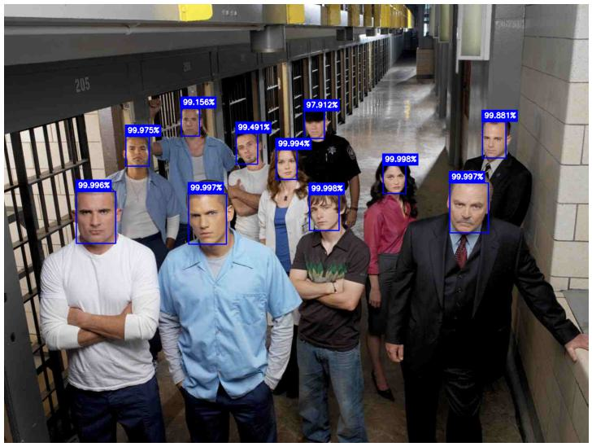

# 基于OpenCV人脸检测
基于OpenCV视觉库在图像或视频流上使用哈尔级联或SSD网络实现人脸检测。

## 开发环境
* Python 3.10
* OpenCV 4.6.0

## 运行项目
在当前项目文件夹下打开cmd
### 参数说明
* 运行`python face_detection.py -h`查看程序参数

### 图像检测
* 运行`python face_detection.py ./data/test.jpg -m ssd -r False -s`检测`./data/test.jpg`
* 运行`python test_WF.py -m ssd -r False`检测`./data/WiderFace/test_image/...`

### 视频流检测
* 运行`python face_detection.py ./data/rowing.mp4 -m ssd -fw caffe -r (300,300) -v -s`检测`./data/rowing.mp4`

## 结果查看
在`./data/result`文件夹下查看保存的检测结果：

