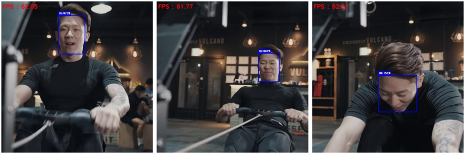

# 基于OpenCV人脸检测
基于OpenCV视觉库在图像或视频流上使用哈尔级联或SSD网络实现人脸检测。

Based on OpenCV, detecting faces in images or video streams using Haar cascades classifier (VJ framework) or SSD networks.

## 开发环境
* OpenCV 4.5.2
* OpenCV-python 4.6.0

## 运行项目
在当前项目文件夹下打开cmd
### Python
运行`python face_detection.py -h`查看程序参数说明
#### 图像检测
* 运行`python face_detection.py ./data/test.jpg -m ssd -r False -s`
* 运行`python test_WF.py -m ssd -r False`
#### 视频检测
* 运行`python face_detection.py ./data/rowing.mp4 -m ssd -fw caffe -r (300,300) -v -s`

### C++
编译`face_detection.cpp`得到可执行文件`face_detection.exe`
#### 图像检测
运行 `.\face_detection.exe ./data/test.jpg ssd F "(0,0)" caffe`
#### 视频检测
运行 `.\face_detection.exe ./data/rowing.mp4 ssd T "(300,300)" caffe`

## 结果查看
在`./data/result`文件夹下查看保存的检测结果：

